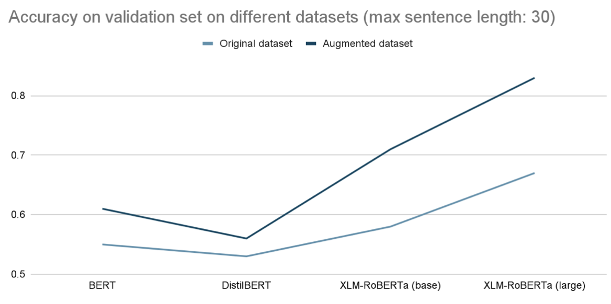

# Detecting contradiction and entailment in multilingual text

## To run the project

<i>Models were trained on Google Cloud Compute with a NVIDIA Tesla K80, 4 vCPUs, 15 GB memory </i>
1. Install the required packages
2. Run `main.py` to train model
3. A `model` folder will be created and the final model will be stored in the folder.
4. Use the `generate_test.py` file to produce the predictions on the test set.

## Problem Statement

Taken from [Kaggle's competition page](https://www.kaggle.com/c/contradictory-my-dear-watson):

Our brains process the meaning of a sentence like this rather quickly.
We're able to surmise:
* Some things to be true: "You can find the right answer through the process of elimination.”
* Others that may have truth: "Ideas that are improbable are not impossible!"
* And some claims are clearly contradictory: "Things that you have ruled out as impossible are where the truth lies.

If you have two sentences, there are three ways they could be related: one could entail the other, one could contradict the other, or they could be unrelated. Natural Language Inferencing (NLI) is a popular NLP problem that involves determining how pairs of sentences (consisting of a premise and a hypothesis) are related.

The task is to create an NLI model that assigns labels of 0, 1, or 2 (corresponding to entailment, neutral, and contradiction) to pairs of premises and hypotheses. To make things more interesting, the train and test set include text in fifteen different languages.

## Data provided

The training set contains 12,120 entries, with the columns (i) id, (ii) premise, (iii) hypothesis, (iv) lang_abv, (v) language and (vi) label. There are 8,209 unique premises, 12,119 unique hypotheses and 3 unique labels.

### Class distribution
Out of the 12,120 entries in the training set, we observe an equal split in 3 classes (0 for entailment, 1 for neutral, 2 for contradiction).

### Language Distribution
That being said, there is an uneven representation in the languages, with English being overrepresented in the dataset. This is expected, as it was explained that the dataset was originally an English dataset that was translated into multiple languages.

### Word count

A histogram of the distribution of word count is also plotted, to understand the nature of the sentences in the dataset. The premise seems to be longer than the hypothesis, with a median of 26 words, while the hypothesis only has a median of 10 words.

## Methodology

### Modelling
We use the `huggingface` library to perform transfer learning on a few encoders built using the transformer architecture. As part of our experiment, we used the following models:

* `distilbert-base-multilingual-cased`
* `bert-base-multilingual-cased`
* `xlm-roberta-base`
* `xlm-roberta-large`

|| Multilingual DistilBERT (cased) | Multilingual BERT (cased) | XLM RoBERTa (base) | XLM RoBERTa (large)
| ----------- | ----------- | ----------- | ----------- | ----------- |
| No. of parameters| 134 mil | 179 mil | 270 mil | 550 mil
| Architecture   | 6-layer, 768-hidden, 12-heads | 12-layer, 768-hidden, 12-heads | 12-layers, 768-hidden-state, 3072 feed-forward hidden-state, 8-heads | 24-layers, 1024-hidden-state, 4096 feed-forward hidden-state, 16-heads 
| Data | Wikipedia in 104 languages | Wikipedia in 104 languages | Trained on 2.5 TB of newly created clean CommonCrawl data in 100 languages | Trained on 2.5 TB of newly created clean CommonCrawl data in 100 languages |

### Data Augmentation
To address the problem of unbalanced language representation, data augmentation was applied to the training set to increase the absolute size of our dataset and diversity of data.

1. Entire training set was translated to english (12k samples), using translation models found in `huggingface`'s repository.
2. Entire training set was converted to the 13 other foreign languages, excluding Thai, as there is no english-to-thai translation model. 

We were thus able to grow our dataset to 160k samples.

## Results

### Performance by model type (trained on original dataset)
As expected, larger models performed better on the validation set. There seems to be a linear relationship between the number of parameters and accuracy. Based on the graph plotted, for every additional 100 million parameters trained, it would give an estimated 3.33% increase in the validation accuracy.

|| Multilingual DistilBERT (cased) | Multilingual BERT (cased) | XLM RoBERTa (base) | XLM RoBERTa (large)
| ----------- | ----------- | ----------- | ----------- | ----------- |
| No. of parameters| 134 mil | 179 mil | 270 mil | 550 mil
| Accuracy |53%|55%|58%|67%|

### Performance after data augmentation

Training our model on this larger dataset allowed us to improve the performance, as seen from the graph below.

|| Multilingual DistilBERT (cased) | Multilingual BERT (cased) | XLM RoBERTa (base) | XLM RoBERTa (large)
| ----------- | ----------- | ----------- | ----------- | ----------- |
| Accuracy (trained on augmented dataset)| 56%|60%|71%|83%|

### Final Model Specifications

| | Training Parameters 
| ------- | -------| 
Model | XLM-RoBERTa (large) |
Data | Translated dataset (160k samples) |
Max sentence length | 30 (limited by vRAM available) |
Epochs | 3 |
Accuracy on validation set | 83%

